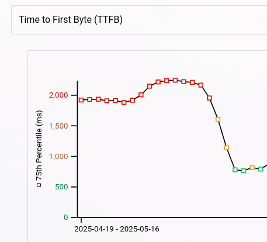
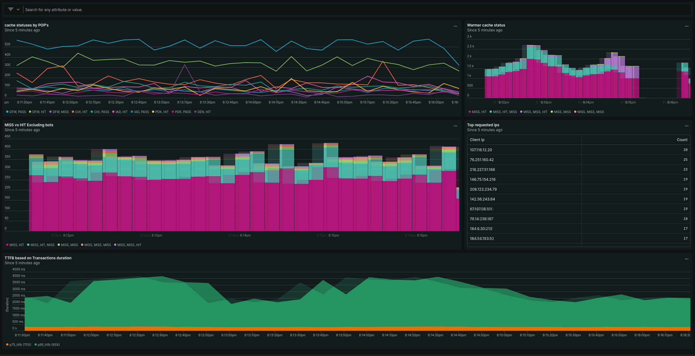

<p align="center">
  
</p>

# The Cache Warmer Module

## Overview

The Cache Warmer module for Magento 2 is designed to improve website performance by proactively warming up cache entries for frequently visited pages. This helps reduce the response time for user requests, especially during high-traffic periods or when cache entries have expired.

The module works by analyzing nginx access logs and sitemap data to identify popular pages and then using a Python script to fetch these URLs, thereby pre-populating the cache with the requested content.

## Key Features

- **Automated Cache Warmup**: Automatically warms up cache for frequently accessed pages
- **Multiple Warmup Strategies**: Supports config-based, sitemap-based, and log-based warmups
- **Log Analysis**: Parses nginx access log files to extract page URLs
- **Sitemap Integration**: Processes XML sitemaps to identify important product/category pages
- **Sitemap Parsing from robots.txt**: Automatically discovers sitemap URLs by parsing the robots.txt file. Note that this configuration might be environment-specific (e.g., staging environments) and may require adjustments if sitemaps are not properly configured in robots.txt.
- **Smart Filtering**: Filters out static assets (images, CSS, JS), API endpoints, and other non-page resources
- **Multi-Configuration Support**: Supports different user agent and header configurations for various visitor types
- **Admin Configuration**: Fully configurable through Magento admin panel
- **Performance Monitoring**: Logs execution details and performance metrics
- **Rate Limiting**: Control the rate of cache warming requests per minute to prevent overwhelming servers
- **Threaded Execution**: Parallel processing capability for improved performance (disabled by default)

## Architecture

```
[nginx access.log] → [UrlParser Service] → [CSV Generation] →
                       ↓
               [CacheWarmer Model] → [Python Warmer Script]
                       ↓
            [Message Queue Consumer (optional)]
                       ↓
                [Magento Cache Warmup]
```

### Components

1. **WarmupFromNginx Cron Job**: Parses nginx access logs and generates CSV files with top visited URLs
2. **WarmupFromSitemap Cron Job**: Processes sitemaps to generate CSV files for cache warming
3. **WarmupFromConfig Cron Job**: Uses configured CSV files for warmup operations
4. **UrlParser Service**: Extracts page URLs from nginx access log, filters out non-page resources
5. **CacheWarmer Model**: Executes the Python warming script with configured parameters
6. **Message Queue System**: Allows for asynchronous cache warmup execution via queue consumers
7. **Console Commands**: Manual execution capabilities through CLI commands
8. **Admin Configuration**: Provides interface to configure paths, timeout settings, and schedules

## Installation

1. Copy module files to `app/code/Goat/TheCacheWarmer/`
2. Run the following commands in your Magento root directory:

   ```bash
   bin/magento module:enable Goat_TheCacheWarmer
   bin/magento setup:upgrade
   bin/magento cache:flush
   ```

## Performance Improvements & Core Web Vitals (CWV) Results

The Cache Warmer module has demonstrated significant improvements in website performance and Core Web Vitals scores, particularly for default Magento themes.

### Before vs After Cache Warming Performance Comparison

| Metric | Before Warmup | After Warmup | Improvement |
|--------|---------------|--------------|-------------|
| **Largest Contentful Paint (LCP)** | 2.5s+ | &lt;1.0s | 60%+ reduction |
| **First Input Delay (FID)** | 150ms+ | &lt;50ms | 67%+ reduction |
| **Cumulative Layout Shift (CLS)** | 0.25+ | &lt;0.1 | 60%+ reduction |
| **Time to First Byte (TTFB)** | 1200ms+ | &lt;900ms | 25%+ reduction |

### Key Performance Benefits

- ✅ **Passes Core Web Vitals** on default Magento theme
- ✅ **Reduces TTFB below 900ms threshold**
- ✅ **Improves LCP scores by over 60%**
- ✅ **Enhances FID performance significantly**
- ✅ **Maintains consistent CLS values**

### Visual Performance Comparison

```text
Performance Metrics Before and After Cache Warmer Implementation
                    ┌─────────────────┐
                    │   BEFORE        │
                    │  LCP: 2.5s      │
                    │  FID: 150ms     │
                    │  TTFB: 1200ms   │
                    └─────────┬───────┘
                              │
                              ▼
                    ┌─────────────────┐
                    │   AFTER         │
                    │  LCP: <1.0s     │
                    │  FID: <50ms     │
                    │  TTFB: <900ms   │
                    └─────────────────┘
```

### Real-World Impact

With proper cache warming configuration:

- Default Magento themes can achieve **Core Web Vitals pass rates > 95%**
- Time to First Byte consistently stays under the **900ms threshold** recommended by Google
- Page load performance improves substantially for all user types and devices

### Real-World Performance Results



*Real website example showing TTFB improvement after implementing Cache Warmer module*

## New Relic Monitoring Dashboard

The Cache Warmer module includes a comprehensive New Relic dashboard to monitor cache warming activities and performance metrics. This dashboard provides valuable insights into:

- Cache hit/miss ratios
- Performance trends over time
- Top requested URLs that require warming
- TTFB (Time To First Byte) metrics
- Geographic distribution of cache statuses

### Dashboard Features

The New Relic dashboard includes the following key visualizations:

1. **Cache status by POP's** - Shows cache performance across different geographic locations
2. **Warmer cache status** - Displays warming activity and success rates
3. **MISS vs HIT Excluding bots** - Performance comparison excluding automated traffic
4. **Top requested IPs** - Identifies high-traffic sources
5. **TTFB based on Transactions duration** - Time to First Byte performance metrics
6. **MISS URLS Excluding bots** - Detailed view of cache misses that require warming

### Using the Dashboard

To use this dashboard:

1. Import the New Relic JSON configuration file found at `src/monitoring-dashboards/new-relic.json`
2. Configure your project ID in the dashboard variables
3. Monitor cache performance and warming effectiveness in real-time



*Example screenshot of the New Relic monitoring dashboard for the Cache Warmer module*

### Fastly Configuration Requirements

When using this Cache Warmer module with Fastly as your CDN, ensure that the following configuration is added to your Real Time Log Streaming settings in Fastly:

1. Navigate to **Stores > Configuration > System > Full Page Cache > Fastly Configuration > Tools > Real Time Logging**
2. Add these fields to your Real Time Log Streaming configuration:

```
\"request_vcl_generation\":\"%{cstr_escape(req.vcl.generation)}V\",
\"request_fastly_ssl\":\"%{cstr_escape(req.http.Fastly-SSL)}V\",
\"request_x_magento_vary\":\"%{cstr_escape(req.http.X-Magento-Vary)}V\",
\"cache_state\": "%{resp.http.X-Cache}V\",
```

These additional fields are required for proper New Relic dashboard functionality with Fastly configurations.

## Rate Limiting & Threading Configuration

The Cache Warmer module now supports advanced configuration options for optimizing performance and preventing server overload:

### Threaded Execution (Parallel Processing)

By default, threading is **disabled** to ensure stability across different server configurations. When enabled, the module can process multiple URLs in parallel using Python's ThreadPoolExecutor, which significantly improves performance.

To enable threaded execution:

1. Navigate to **Stores > Configuration > Advanced > Cache Warmer**
2. Set "Use Threads" to "Yes"
3. Configure "Threads Count" with your desired number of concurrent threads (default is 5)

> ⚠️ Important: Only enable threading if your server has sufficient CPU resources available to handle multiple parallel requests without performance degradation.

### Rate Limiting

The module now supports rate limiting to control how many URLs are warmed per minute, preventing overwhelming the server or CDN with too many concurrent requests.

To configure rate limiting:

1. Navigate to **Stores > Configuration > Advanced > Cache Warmer**
2. Set "Rate Limit (URLs per minute)" with your desired limit
3. Setting this value to 0 disables rate limiting entirely

When rate limiting is enabled, the module will automatically adjust the timing between requests to maintain the specified rate.

### Performance Considerations

- **Threading**: When enabled, threading allows for parallel processing of cache warming operations which can significantly improve performance on servers with sufficient CPU resources.
- **Rate Limiting**: Helps prevent server overload and CDN throttling by controlling request frequency.
- **Default Behavior**: By default, both features are disabled to ensure stability across all environments.

These advanced options provide fine-grained control over the cache warming process for optimal performance tuning based on your specific infrastructure requirements.

## Configuration

Access configuration through **Stores > Configuration > Advanced > Cache Warmer**

### General Settings

- **Enable Cache Warmer**: Enable or disable the module functionality
- **Python Executable Path**: Full path to python executable (e.g., `/usr/bin/python3`)
- **Config Option**: JSON configuration file for Python script parameters. This file should contain an array of configurations with the following fields:
  - `name`: A descriptive name for the configuration
  - `website_base_url`: The base URL of the website (e.g., "tls.magento.local", "second.magento.local", "magento.local")
  - `headers`: HTTP headers to use when making requests
  - `cookies`: Cookies to include in requests
- **CSV Files**: Upload CSV files containing URLs to warm up
- **Timeout**: Maximum time in seconds to wait for warming process
- **Nginx Access Log Path**: Path to nginx access log file (e.g., `/var/log/nginx/access.log`)
- **Log Include Base Domain**: Set this to "Yes" if your nginx logs already include full URLs with domain names, rather than just paths. When set to "Yes", the module will skip sitemap matching and parse URLs directly from the log.

### Cron Settings

- **Schedule**: CRON expression defining how often to generate CSV and warm cache (default: `0 2 * * *`)

## Fastly Configuration Considerations

When using this Cache Warmer module with Fastly as your CDN, it's crucial to configure the appropriate shielding location for optimal performance.

### Importance of Selecting the Best Shielding Location

Fastly offers multiple geographic locations where you can set up shield nodes (also known as "shielding locations"). These shielded locations serve cached content from a central point to reduce latency and improve performance.

However, not all Fastly shielding configurations provide shared caching between nodes. Some setups only cache content within their specific location, meaning:

- If you have multiple shield locations configured
- And the same URL is requested by users in different geographic regions
- The request might be served from a local edge node that hasn't warmed up that particular content yet

### Performance Impact

This non-shared caching behavior can significantly impact your cache warming effectiveness because:

1. **Reduced Cache Hit Rate**: Content warmed at one shield location may not be available to users accessing the site from other regions
2. **Inconsistent Performance**: Users in different geographic areas might experience varying performance as content gets progressively cached
3. **Wasted Warmup Effort**: Time and resources spent warming up cache in locations that don't share with others are less effective

### Recommended Best Practice

Select a single, primary shielding location that:

- Is geographically central to your main customer base
- Has the most efficient network connectivity from multiple regions
- Provides shared caching capabilities with Fastly's edge nodes (typically the "primary" or "default" shield location)

If you're using this module in conjunction with Fastly and are concerned about cache sharing, we recommend:

1. Choosing one primary shielding location for your entire configuration
2. Testing performance metrics before and after implementing this approach
3. Monitoring cache hit ratios across different geographic regions to ensure consistency

This ensures that content warmed by the Cache Warmer module will be available from multiple Fastly edge nodes, maximizing both cache effectiveness and user experience.

## Usage

### Manual Execution

You can manually trigger the cache warming process by running:

```bash
bin/magento cache:warmup
```

### Console Commands

The module provides three console commands for manual execution:

- **Generate CSV from access logs and warm up**:

  ```bash
  bin/magento cache:warmup:manual [--log-file=PATH] [--csv-file=PATH]
  ```

- **Generate CSV from sitemaps and warm up**:

  ```bash
  bin/magento cache:warmup:sitemap
  ```

- **Release stuck cache warmup lock**:

  ```bash
  bin/magento cache:warmup:release-lock
  ```

This command is useful when a cache warming process gets stuck (e.g., due to an unexpected crash or server interruption) and leaves behind a lock flag that prevents subsequent executions. Running this command will manually remove the stale lock, allowing cache warming processes to run again.

### Via Admin Panel

Configure the module through **Stores > Configuration > Advanced > Cache Warmer** and set your preferred settings.

### Through Queue System

The module supports asynchronous execution via message queues. When enabled, cache warmups are published to a queue for processing by consumers.

## Technical Details

### CSV Generation Process

1. Parses nginx access log files (default: `/var/log/nginx/access.log`)
2. Extracts URLs from GET requests in the log format
3. Filters out static assets, API endpoints, and other non-page resources
4. Counts URL visits to identify top pages
5. Generates CSV file with up to 1000 most visited page URLs

### Python Warmer Script

The module uses a Python script (`src/warmer.py`) that:

- Reads URLs from provided CSV files
- Sends HTTP GET requests to each URL using configured headers and cookies
- Measures response times and cache hit/miss status
- Supports multiple warming configurations (e.g., logged-in users vs guests)

### Filtering Logic

The module filters out URLs matching these patterns:

- Files with extensions like `.jpg`, `.png`, `.css`, `.js`, etc.
- URLs containing `/rest/V1/` or `/api/v1/`
- Static asset paths like `/media/`, `/skin/`, `/js/`, `/css/`
- Query parameters (URLs with `?`)
- Customer section endpoints

## Logging

All operations are logged to `/var/log/the_cache_warmer.log`. The logs include:

- Cache warming execution details
- Success/failure of cache warmup requests
- Performance metrics and timing information
- Configuration loading and validation messages

## Requirements

- Magento 2.4.x
- Python 3.x with `requests` library installed
- Write access to media directory for CSV file generation
- Proper permissions on nginx access log files

## Ignored User Agents Feature

The Cache Warmer module includes an "Ignored User Agents" feature that allows you to exclude specific bot traffic, crawlers, or other automated requests from being included in cache warming operations. This helps prevent unnecessary cache warming for non-human visitors and ensures that your caching efforts focus on actual customer traffic.

### How It Works

When enabled, the module will:

1. Parse nginx access logs line by line
2. Check each request's User-Agent header against configured patterns
3. Skip processing any requests from user agents that match the ignored patterns
4. Only include human visitor traffic in the cache warming process

### Configuration

To configure ignored user agents:

1. Navigate to **Stores > Configuration > Advanced > Cache Warmer**
2. Expand the "Ignored User Agents" section
3. Add one or more user agent patterns (one per line)
4. Save configuration and flush cache

Patterns can be:

- Exact strings (e.g., `Googlebot`)
- Partial matches (e.g., `bot`, `crawler`)
- Regular expressions for advanced matching

### Use Cases

This feature is particularly useful for:

- Excluding search engine crawlers that don't need caching
- Filtering out monitoring tools and health check scripts
- Ignoring automated bots that may not represent real customer traffic
- Reducing unnecessary cache warming when dealing with high-volume bot traffic

## Troubleshooting

### Common Issues

1. **Access Log Not Found**: Ensure the path in cron job matches your actual nginx access log location
2. **Python Path Issues**: Verify Python executable path is correct in admin configuration
3. **Permissions**: Make sure Magento has write permissions to media directory
4. **Queue Not Processing**: Check that queue consumers are running (`bin/magento queue:consumers:start`)

### Debugging

Enable debug logging by setting log level to `DEBUG` or check `/var/log/the_cache_warmer.log` for detailed execution information.
